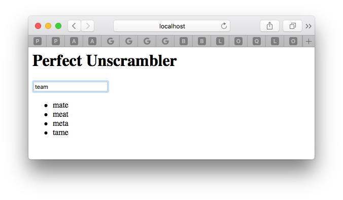

# Perfect Unscrambler Demo [简体中文](README.zh_CN.md)

<p align="center">
    <a href="http://perfect.org/get-involved.html" target="_blank">
        
    </a>
</p>

<p align="center">
    <a href="https://github.com/PerfectlySoft/Perfect" target="_blank">
        
    </a>  
    <a href="http://stackoverflow.com/questions/tagged/perfect" target="_blank">
        
    </a>  
    <a href="https://twitter.com/perfectlysoft" target="_blank">
        
    </a>  
    <a href="http://perfect.ly" target="_blank">
        
    </a>
</p>

<p align="center">
    <a href="https://developer.apple.com/swift/" target="_blank">
        
    </a>
    <a href="https://developer.apple.com/swift/" target="_blank">
        
    </a>
    <a href="http://perfect.org/licensing.html" target="_blank">
        
    </a>
    <a href="http://twitter.com/PerfectlySoft" target="_blank">
        
    </a>
    <a href="http://perfect.ly" target="_blank">
        
    </a>
</p>


This project demonstrates an in-memory server to unscramble English word puzzles based on Perfect HTTP Server.

Ensure you have installed and activated the latest Swift 3.1 tool chain.


## Build & Run


Follow the bash commands below to download, build and run this project:

```
$ git clone https://github.com/PerfectExamples/Perfect-Unscrambler.git
$ cd Perfect-Unscrambler
$ swift build
$ .build/debug/Unscrambler
```

It will need a few seconds to download the online dictionary text and do some indexing, so please wait until the following messages appeared in your terminal:

```
[BOOT] 354983 words are loaded into 311906 groups.
[INFO] Starting HTTP server localhost on 0.0.0.0:8888
```

This means you can use browser to check `http://localhost:8888` now:

<p></img></p>

If nothing wrong, you can type any words into the input box and shall see solutions immediately.


To stop the server, simply go back to the terminal and type `CTRL-C`.

## Features

- **No Database Required**: Perfect Unscrambler uses Swift `Dictionary` as the primary data structure to solve the input puzzle other than depending on any databases.

- **In-Memory & Indexing**: In this example, a frequency table has been applied to solve the incoming puzzle as the key of indexing. All operations are taking in memory which maximizes the server performance.

- **Reactive Extensions Demo**: This demo also shows how jQuery / ReactJS works with Perfect Server.

## Third Party Dependencies

This example server depends on three open sourced web links below, and you can modify or replace them in the source code `main.swift` if broken:

``` swift
/// any valid word list file given each word per line.
let dictionaryURL = "https://raw.githubusercontent.com/dwyl/english-words/master/words.txt"

/// cdn of jQuery
let jqueryURL = "https://code.jquery.com/jquery-1.12.4.min.js"

/// github source of Reative-Extensions javascript
let reactiveURL = "https://raw.githubusercontent.com/Reactive-Extensions/RxJS/master/dist/rx.lite.compat.min.js"

```

**LICENSE & COPYRIGHT** 

Please note that the web links above are not a part of this project (Perfect Unscrambler) and are also subject to the corresponding owner's copyright and license.

Please also check the attached license for more information.

## Basic Idea

The key to solve the scramble puzzle is using an alphabetic frequency table to compare the puzzle and corresponding candidates, as picture below:

<p></img></p>

As you can see, we can write down the frequency number of each letter in a word and use this information to look solutions in the dictionary, which means any word with the same frequency table will be a valid solution.

In the picture above, word "TEAM" can be summarized as one "A", one "E", one "M" and one "T", so we can make a note for this word as `A1E1M1T1` if put everything in order. Here we name this note as the **signature** of a word.

Then imagine that given a dictionary in hand, we can pick out the word from the dictionary one by one, and redo the same frequency calculation to see if the solution will pop out when both words share the same frequency signature. In the picture example, four different solutions - "MATE", "MEAT", "META" and "TAME" -  are found for sharing the same key "A1E1M1T1" with "TEAM".

## Indexing

Of course up to now, we can calculate the user input and check the whole dictionary during the server request. However, going over a large dictionary is always a time consuming process. To avoid unnecessary real time iteration, a prebuilt indexing procedure before accepting any incoming requests - which means to calculate the frequency signatures of each word after loading the dictionary and then preserve these signatures in memory - is a good idea.

In this case, a `WordGroups` class is well designed to store the whole well-indexed dictionary. Core storage of `WordGroups` is a Swift `Dictionary<key, value>` structure, i.e, the variable type of `[String:[String]]`, where as the signature is the key and the value is a group of words which share the same signature.

So here are the server booting procedures:

1. download dictionary - about 350,000+ words in our example.
2. perform indexing over the words - the words will be divided into 300,000+ groups, which means about 50,000 words have multiple solutions to specific scrambles.
3. start the HTTP server.

Once successfully booted, the server should respond to any request in an amazing speed - calculate the signature, retrieve the solution array pick out the group and send it back, or return a blank array to represent "nothing found".

## Project Walkthrough

The whole project only contains three Swift source files.

### Package.swift

It is a common file required by Swift Package Manager, with key lines of components for the server:

``` swift
    dependencies: [
	.Package(url: "https://github.com/PerfectlySoft/Perfect-HTTPServer.git", majorVersion: 2),
	.Package(url: "https://github.com/PerfectlySoft/Perfect-CURL.git", majorVersion:2)	
  ]
```

Among these dependencies, *Perfect-HTTPServer* includes all essential functions of a Swift HTTP Server on both mac / linux; *Perfect-CURL* is a library that enables the Swift code to load dynamic data from other web api services.


### WordGroups.Swift

WordGroups class has only three functions:

- `func signature()`: This is the key of whole algorithm, which summaries a word to a string to represent the corresponding frequency table of the input word.

``` swift
// prepare an empty frequency table
var table:[UInt8: Int] = [:]
// get the lowercased string
word.lowercased().utf8
// remove all non-alphabetic characters, numbers and symbols
.filter {$0 > 96 && $0 < 123}
// build the frequency table
.forEach { char in
	// get the current frequency of the objective character
	let f = table[char] ?? 0
	// increase one for the current
	table[char] = f + 1
}//next

// must sort
return table.keys.sorted()
// map it to strings like `a1`
.map { key -> String in
	let buffer:[UInt8] = [key, 0]
	return String(cString: buffer) + String(describing: table[key] ?? 0)
}
// finally, join all key-frequency pair
.joined()
```

- `init()`: The constructor of `WordGroups` class, it will download a dictionary from the url, which is a long wordlist and each line of the list is a unique word. Once downloaded, it will automatically divid the whole list into different groups, each group will marked with a unique signature calculated from the `signature()` function.

``` swift
// download the online dictionary
let curl = CURL(url: url)
let r = curl.performFullySync()
curl.close()

// split the dictionary into lines
r.bodyBytes.split(separator: 10).forEach {
	// turn the buffer into a string
	var s = Array($0)
	s.append(0)
	let word = String(cString: s)

	// calculate the signature
	let sig = signature(word: word)
	// get the group by signature
	var list = groups[sig] ?? []
	// add the new word into group
	list.append(word)
	groups[sig] = list
}//next
```

- `func solve()`: Users can input any scramble into this function and it will calculate the signature of the input word as the other did in the loading stage. Then it will look up the existing groups for the key signature and would return the group if found.

``` swift
// calculate the key
let key = signature(word: scramble)

// retrieve the group from groups
return groups[key] ?? []
```

### main.swift

`main.swift` is the main entry of the server, which is a typical [PerfectTemplate](https://github.com/PerfectlySoft/PerfectTemplate.git) application. The server will provide only two routes:

- `/api` - the api handler, i.e., if `$ curl http://localhost:8888/api?inp=meat`, it will respond something like: `["mate","meta","tame","team"]` for the expected solution in JSON format.

``` swift
	request, response in
    let input = sanitizedInput("inp", request)
    let list = words.solve(scramble: input)
    do {
      let json = try list.jsonEncodedString()
      response.appendBody(string: json)
    }catch {
      response.appendBody(string: "[\"Error\"]")
    }//end do

    response.completed()
```

- `/` - the root handler, i.e., a static HTML home page, but client user behaviour - type any puzzle into the input box and immediately pop out all possible unscramble solutions - is controlled by a small piece of jQuery/Reactive-Extension script embedded in the HTML. Actually it is the same code digested with a little modification to fit our server output from [Github Reactive-Extension Repo](https://github.com/Reactive-Extensions/RxJS):

``` javascript
// call the server, equivalent to `$ curl http://localhost:8888/api?inp=term`
    function search (term) {
      return $.ajax({
        url: 'api', 
        dataType: 'json',
        data: { inp: term }
      }).promise();
    }//end search

    function main() {
      var $input = $('#textInput'),
          $results = $('#results');

      // check input
      var keyup = Rx.Observable.fromEvent($input, 'keyup')
        .map(function (e) {
          return e.target.value;
        })
        .filter(function (text) {
          return text.length > 2;
        })
        .debounce(200 /* Pause for 200ms */ )
        .distinctUntilChanged();

      var searcher = keyup.flatMapLatest(search);

      // set the callback & display them once got data
      searcher.subscribe(
        function (data) {
          $results
            .empty()
            .append ($.map(data, function (v) { return $('<li>').text(v); }));
        });
    }
``` 

## Issues

We are transitioning to using JIRA for all bugs and support related issues, therefore the GitHub issues has been disabled.

If you find a mistake, bug, or any other helpful suggestion you'd like to make on the docs please head over to [http://jira.perfect.org:8080/servicedesk/customer/portal/1](http://jira.perfect.org:8080/servicedesk/customer/portal/1) and raise it.

A comprehensive list of open issues can be found at [http://jira.perfect.org:8080/projects/ISS/issues](http://jira.perfect.org:8080/projects/ISS/issues)

## Further Information
For more information on the Perfect project, please visit [perfect.org](http://perfect.org).


## Now WeChat Subscription is Available (Chinese)
<p align=center></p>
