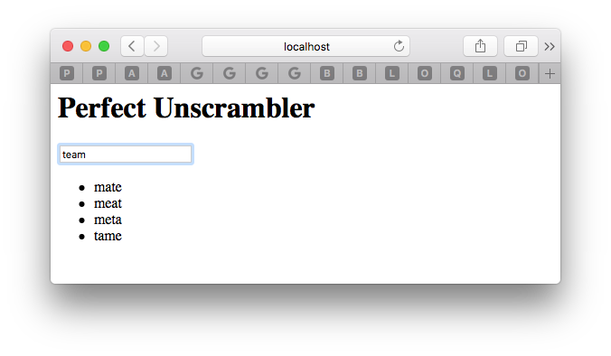
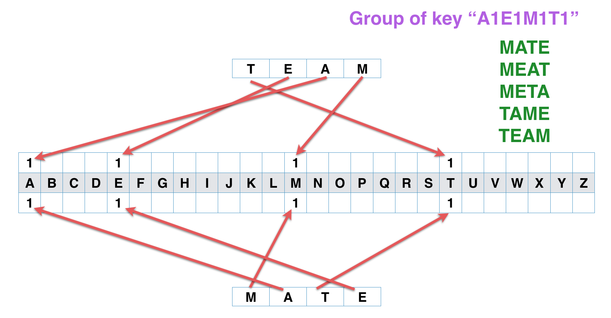

# Perfect Unscrambler 猜谜示范 [English](README.md)

<p align="center">
    <a href="http://perfect.org/get-involved.html" target="_blank">
        
    </a>
</p>

<p align="center">
    <a href="https://github.com/PerfectlySoft/Perfect" target="_blank">
        
    </a>  
    <a href="http://stackoverflow.com/questions/tagged/perfect" target="_blank">
        
    </a>  
    <a href="https://twitter.com/perfectlysoft" target="_blank">
        
    </a>  
    <a href="http://perfect.ly" target="_blank">
        
    </a>
</p>

<p align="center">
    <a href="https://developer.apple.com/swift/" target="_blank">
        
    </a>
    <a href="https://developer.apple.com/swift/" target="_blank">
        
    </a>
    <a href="http://perfect.org/licensing.html" target="_blank">
        
    </a>
    <a href="http://twitter.com/PerfectlySoft" target="_blank">
        
    </a>
    <a href="http://perfect.ly" target="_blank">
        
    </a>
</p>

本项目展示了如何使用Perfect HTTP服务器搭建一个专门用于破解英语字谜游戏（输入打乱顺序的一组字母然后自动找出合理的英语单词）的服务器，并实现了内存查询优化。

请确保您的系统已经安装了Swift 3.1工具链。

## 下载、编译和运行

请使用下列bash命令下载、编译和运行本项目：

```
$ git clone https://github.com/PerfectExamples/Perfect-Unscrambler.git
$ cd Perfect-Unscrambler
$ swift build
$ .build/debug/Unscrambler
```

HTTP服务器的启动会需要一段时间，主要是从网上在线下载一个英文字典并执行内存索引，因此请耐心等待直到您的终端控制台出现下列信息：

```
[BOOT] 354983 words are loaded into 311906 groups.
[INFO] Starting HTTP server localhost on 0.0.0.0:8888
```

这意味着服务器已经成功启动，现在您可以使用浏览器查看地址`http://localhost:8888`，如下图所示：

<p></img></p>

如果没问题的话，您的任何输入都可以立刻看到将您当前输入作为谜面的所有谜底。

如果需要停止服务器，请使用组合键`CTRL-C`。

## 程序特点

- **不需要使用数据库**: Perfect Unscrambler 采用了 Swift 原生的`Dictionary` 字典作为主要数据结构，用于破解字谜而且不依赖任何一种数据库。

- **In-Memory & Indexing**: 本案例中，破解字谜的关键是使用了字母频率表作为解密索引。所有操作都是在内存中完成并将服务器性能优化到极限水平。

- **ReactJS 展示**: 本项目同时还展示了如何使用 jQuery / ReactJS 来实现Perfect 类型的服务器查询。

## 第三方资源引用

本项目使用了如下三个开源的互联网资源。如果未来发现以下资源不可用，您可以自行找到`main.swift`文件修改或替换这些资源：

``` swift
/// any valid word list file given each word per line.
let dictionaryURL = "https://raw.githubusercontent.com/dwyl/english-words/master/words.txt"

/// cdn of jQuery
let jqueryURL = "https://code.jquery.com/jquery-1.12.4.min.js"

/// github source of Reative-Extensions javascript
let reactiveURL = "https://raw.githubusercontent.com/Reactive-Extensions/RxJS/master/dist/rx.lite.compat.min.js"

```

**许可证和版权** 

请注意上述资源链接并非本工程（Perfect Unscrambler）的一部分，其有效性及合法性受其所有权单位的版权及许可证约束。同时请查看本工程目录下有关的许可证信息。

## 基本思路

解决此类字谜游戏的关键是使用字典+字频表，即每个单词都一个建立一个对应的字母频率表，而字典中所有与之相同的字母频率表对应的单词都是有效的谜底答案，如下图所示：

<p></img></p>

图中单词“TEAM”（意为团队）可以记录为1个A、1个E、1个M和1个T，因此可以按顺序简记为 `A1E1M1T1`。我们称这种统计方法叫做单词的**字频签名（signature）**。

假设我们手边正好有本英文字典，那么最直接的方法就是逐页逐条将所有字典中的单词均以字频签名的方式表达，那么一旦发现签名与谜面完全一致的单词，则可判定为有效的谜底。图例中，字典中找到了其他四个与“TEAM”具有共同字频特征“A1E1M1T1”的单词，分别是：”、“MEAT”、“META”和“TAME”。

## 制作索引

当然我们可以在运行服务器的时候，每接到一个谜面都到字典中重复上述过程，但是遍历整本字典是件耗时耗力的工作。为了避免不必要的重复计算，我们在这里介绍给这个字典建立索引的方法——也就是说，在服务器启动时加载字典的同时即刻开始为所有单词建立字频签名并将所有单词按照签名进行分组管理——很显然这是个好主意。

本案例使用一个专门设计好的 `WordGroups` 类对象用于完成上述工作。其中其核心数据结构是Swift 语言的 `Dictionary<key, value>` 字典，即<关键词-字符串>，也就是我们通常所说的`[String:[String]]`类型变量。其中字频签名被用作了关键词，而字符串当然就是具有相同签名的一组谜底啦。

服务器启动时制作索引的过程如下：

1. 下载字典 - 本项目下载了一个具有35万个单词的字典。
2. 制作索引 - 本案例中服务器会建立大约30万个字频分组，也就是说，至少有5万个左右的单词在对应同一个谜面的游戏时会有不止一个的谜底答案。
3. 启动HTTP服务器。

一旦成功启动，服务器就能够以惊人的速度破解任何字谜——采用相同的方式计算谜面的字频签名，然后根据签名直接从内存的单词分组中提取出来再返回到浏览器。如果无解则返回空数组。

## 源代码简介

整个案例工程只有三个Swift源程序：

### Package.swift

即SPM软件包管理器在编译项目时标准的源程序，核心代码如下：

``` swift
    dependencies: [
	.Package(url: "https://github.com/PerfectlySoft/Perfect-HTTPServer.git", majorVersion: 2),
	.Package(url: "https://github.com/PerfectlySoft/Perfect-CURL.git", majorVersion:2)	
  ]
```

上述依存关系中， *Perfect-HTTPServer* 包括了启动一个Swift语言在 mac / linux 上开发HTTP服务器的所有必要功能；而 *Perfect-CURL* 用于Swift语言在服务器上动态访问其他互联网服务器提供的编程接口服务。

### WordGroups.Swift

该类对象代码只包括下列三个函数：

- `func signature()`：字频签名的核心算法，即用一个字频表代表字符串的频率特征。

``` swift
// 首先准备一个空的字频表
var table:[UInt8: Int] = [:]
// 将输入的字符串转化为全部小写
word.lowercased().utf8
// 忽略所有非英文字母的数字或者符号
.filter {$0 > 96 && $0 < 123}
// 创建字频表
.forEach { char in
	// 获取当前字母出现频率
	let f = table[char] ?? 0
	// 频率加1
	table[char] = f + 1
}//next

// 必须按顺序排序
return table.keys.sorted()
// 将字频转化为形如 `a1`的字符串
.map { key -> String in
	let buffer:[UInt8] = [key, 0]
	return String(cString: buffer) + String(describing: table[key] ?? 0)
}
// 最后将所有<字母-频率>合并成为一个字符串
.joined()
```

- `init()`：构造函数，即首先下载字典（每行一个单词）文件然后转化为按字频分组的字典结构。

``` swift
// 首先下载字典
let curl = CURL(url: url)
let r = curl.performFullySync()
curl.close()

// 将字典按行转换为单词列表
r.bodyBytes.split(separator: 10).forEach {
	// 将一行内容转化为一个字符串
	var s = Array($0)
	s.append(0)
	let word = String(cString: s)

	// 计算字频签名
	let sig = signature(word: word)
	// 获取所在分组
	var list = groups[sig] ?? []
	// 将新单词加入分组
	list.append(word)
	groups[sig] = list
}//next
```

- `func solve()`：解谜——用户可以使用该函数输入任何谜面，该函数会采用同样算法计算输入字符串的字频特征签名，并根据该签名从内存字典分组中找到对应的分组；

``` swift
// 计算谜面的字频签名
let key = signature(word: scramble)

// 直接返回该签名所在分组
return groups[key] ?? []
```

### main.swift

`main.swift` 是该服务器的门户入口，是一个典型的[PerfectTemplate](https://github.com/PerfectlySoft/PerfectTemplate.git) 模板程序。该服务器只提供两个路由资源：

- `/api` - 编程接口路由控制器，即如果调用 `$ curl http://localhost:8888/api?inp=meat`，则会返回形如`["mate","meta","tame","team"]`的JSON格式作为谜底。

``` swift
	request, response in
    let input = sanitizedInput("inp", request)
    let list = words.solve(scramble: input)
    do {
      let json = try list.jsonEncodedString()
      response.appendBody(string: json)
    }catch {
      response.appendBody(string: "[\"Error\"]")
    }//end do

    response.completed()
```

- `/` - 根路由，即一个静态的HTML主页页面。但是客户端的行为 - 输入任何谜面则立刻看到谜底 - 是由在该主页中嵌入的一小段 jQuery/Reactive-Extension 脚本控制的。实际上这段javascript脚本是在[Github Reactive-Extension Repo 说明页面](https://github.com/Reactive-Extensions/RxJS)上稍加修改而来：

``` javascript
// 调用服务器编程接口寻找答案，相当于 `$ curl http://localhost:8888/api?inp=term`
    function search (term) {
      return $.ajax({
        url: 'api', 
        dataType: 'json',
        data: { inp: term }
      }).promise();
    }//end search

    function main() {
      var $input = $('#textInput'),
          $results = $('#results');

      // 检查输入
      var keyup = Rx.Observable.fromEvent($input, 'keyup')
        .map(function (e) {
          return e.target.value;
        })
        .filter(function (text) {
          return text.length > 2;
        })
        .debounce(200 /* 两次查询之间控制 200ms 间隙*/ )
        .distinctUntilChanged();

      var searcher = keyup.flatMapLatest(search);

      // 设置回调函数取回并显示数据
      searcher.subscribe(
        function (data) {
          $results
            .empty()
            .append ($.map(data, function (v) { return $('<li>').text(v); }));
        });
    }
``` 

### 问题报告、内容贡献和客户支持

我们目前正在过渡到使用JIRA来处理所有源代码资源合并申请、修复漏洞以及其它有关问题。因此，GitHub 的“issues”问题报告功能已经被禁用了。

如果您发现了问题，或者希望为改进本文提供意见和建议，[请在这里指出](http://jira.perfect.org:8080/servicedesk/customer/portal/1).

在您开始之前，请参阅[目前待解决的问题清单](http://jira.perfect.org:8080/projects/ISS/issues).

## 更多信息
关于本项目更多内容，请参考[perfect.org](http://perfect.org).

## 扫一扫 Perfect 官网微信号
<p align=center></p>